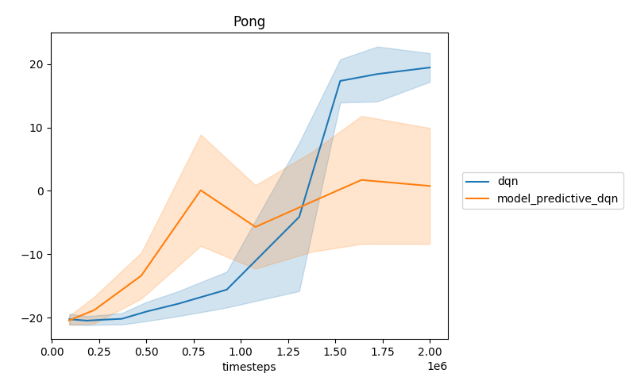

## About

This repository shows how  [Autonomous Learning Library](https://github.com/cpnota/autonomous-learning-library) can be used to build new reinforcement learning agents.
In particular, it contains a *model predictive* agent that predicts future frames and uses them to guide decision making.

## Instructions

First, you'll need the latest version of [Pytorch](https://pytorch.org).
If you wish to view [Tensorboard](https://github.com/tensorflow/tensorboard) logs, you'll also need to grab a copy of that (it also comes with `tensorflow`).
Then, you'll need to install the `autonomous-learning-library`:


```
pip install autonomous-learning-library
```

## Usage

You can run the agent as well as a baseline DQN agent using:

```
python main.py Pong
```

You can track progress using:

```
tensorboard --logdir runs
```

Once the script has finished (could take a long time, especially if you do not have a fast GPU!), you can see the final results using:

```
python plot.py
```

## Results

For us, the above instructions produced the following results:



As you can see, this agent isn't very good!
On the other hand, the purpose of this agent was not performance,
but to demonstrate the utility of the `autonomous-learning-library` in developing *new* agents not included in the original library.
Maybe you can come up with ways of improving this agent!
